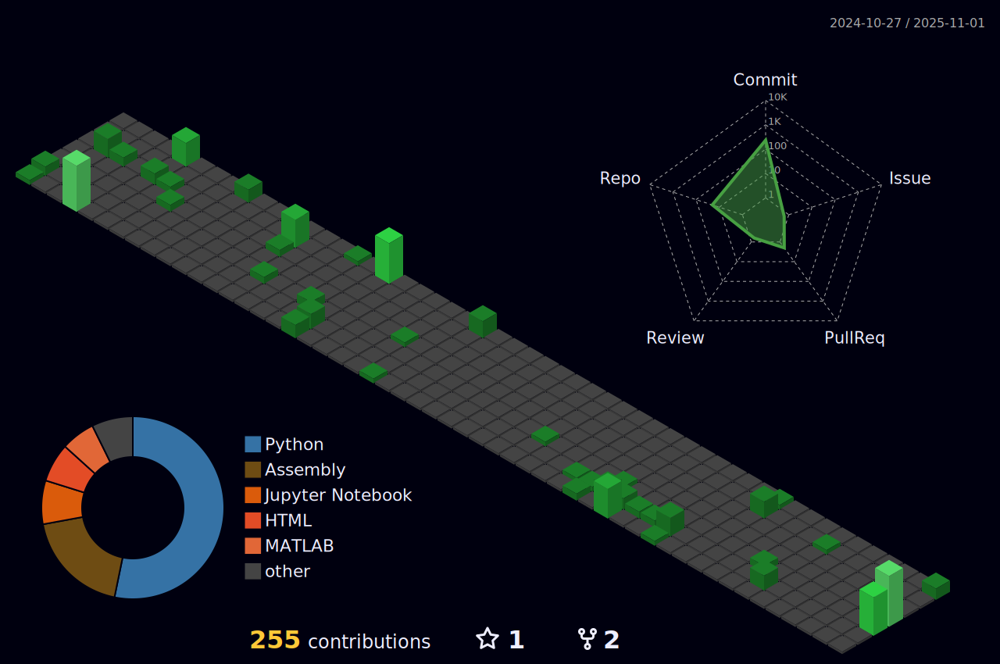

I love researching and solving problems in the field of AI.  
[Website](https://github.com/Abhyuday-06) 
[LinkedIn](https://in.linkedin.com/in/abhyuday-vaish) 

## Tech Stack

                 

## GitHub Stats

 

## 3D Contribution Graph

